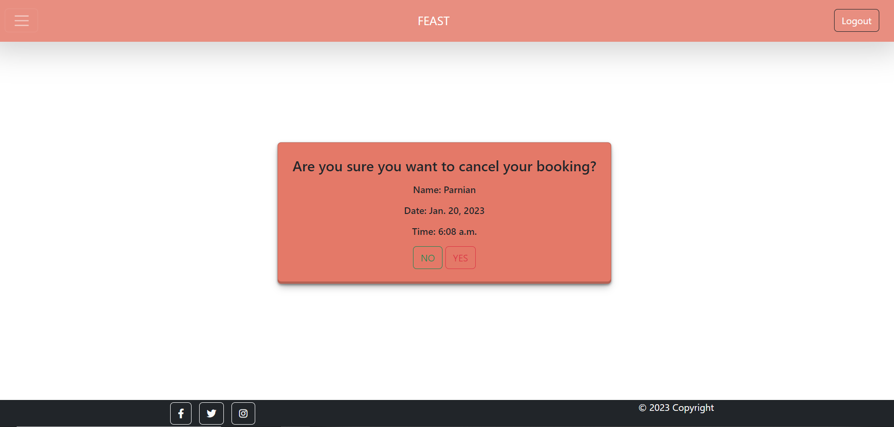
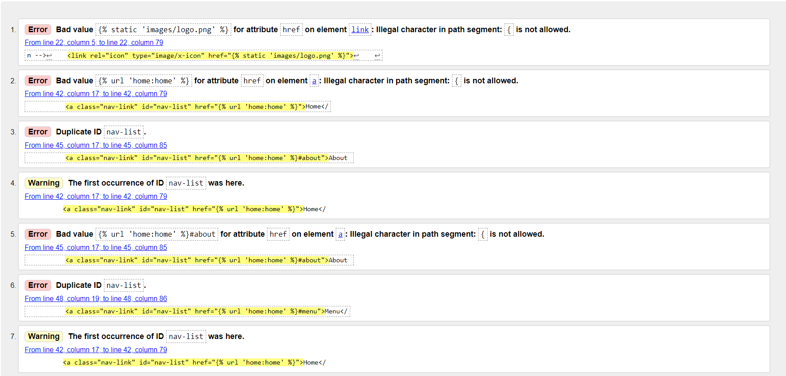

# **FEAST**

### **Purpose of the project**
Feast is a restaurant for an online booking system. Using this website the user can reserve a table for maximum 10 guests in a particular date and time. The user can reserve several tables. Furthermore, the user needs to register to be able to reserve the table or check her bookings. The user can also edit her booking or cancel it. Also the user can not reserve a table with the same email twice as for the next update of the website, a confirmation email will be sent to the user for the her booking.

 
 
Visit the live website [in here](https://restaurant-booking-system.herokuapp.com/)
 

## Table of Contents
  * [Purpose of the project](#purpose-of-the-project)
  * [Agile Planning](#agile-planning)
    * [User Stories](#user-stories)
    * [Users](#users)
    * [Epics](#epics)
  * [Features](#features)
  * [Future Features](#future-features)
  * [Typography and color scheme](#typography-and-color-scheme)
  * [The Skeleton Plane](#the-skeleton-plane)
    * [Wireframes and Designs](#Wireframes-and-Designs)
    * [Database Design](#database-design)
  *  [Testing](#testing)
      * [code validation](#code-validation)
      * [test cases](#test-cases)
      * [Bugs](#bugs😶)
      * [supported screens and browsers](#supported-screens-and-browsers)
  * [Technolgies](#technolgies)
  *  [Deployment](#deployment)
  *  [Credits](#credits)


## **Agile planning**
 --- 
The Agile method was used to plan, work and deploy this project. The whole process was shown in Kaban Board project through github <a href="https://github.com/users/MuzhdaN/projects/2" target="_blank">Kaban Board</a>

In Kaban board was created using github projects. This project's user stories or tasks were tracked/planned within four categories, Todo, In progres, Done, Won't have in the Kaban board. 


The issues section in github was used to add user stories. Accordingly lables for each user story were added so the developer would be able to prioritize them. Some of the labels were such as, bug, enhancement, 

There were four milestones for this project. It should be noted that the developered weren't able to finish the assigned tasks within the specific time frame of the milestone which should be noted for the future projects. 

### **Users**
We were able to identify the following users:
    1. Visiting user
    2. Registered user
    3. Admin
    4. Site owner
    
### **Epics**
### Epic 1 Project Setup
The developer set up the basics of the projects. As the Django was a new lanaguage for the developer, it needed insitalliation and setup, without this epic the other parts of the projects wouldn't have worked. Also automatic Admin interface was creaded. 

### Epic 2 Deployement Setup
The Deployement was done after the base of the project, as deployement is complicated the developer did it at the begning of the project so at the end it wouldn't create much problems. 

### Epic 3 Frontend of the website
The developer used mostly Bootstrap to design and build website's frontend, therefore multiple sections were included within this epic. This includes the following 
- Home page
    - Header
    - About 
    - Menu 
    - Customer Reviews
    - Contact info 
    - Footer
- Reservation page

### Epic 4 Authentication 
The authenication of the website was done
using [django-allauth](https://django-allauth.readthedocs.io/en/latest/) therefore backend (django) and frontend (HTML, CSS, Bootstrap) was combined within one epic. 

### Epic 5 Reservations
This epic inculdes the booking (creating), reading, updating (Editing) and deleting of a table by a registered user. All the CRUD functionality has been used. 

### Epic 6 Documentation  
This epic includes readme file. All the process of the project should be documented and added in to README file in the github. The documentation should be done at the end of each milestone. 

## User Stories
The follwoing user stories are categorized based on the users. 
### Site Owner 
- As a site owner, I would like the website to be responsive so the website would be accessible in all devices. 
- As a site owner, I would like to have a booking system in my restaurant's website so that my customers would be able to book a table before coming to the restaurant. 
- As a site owner, I would like to have an Admin user so my restaurant manager could customize the website. (Django has an Admin interface)  
- As a site owner, I would like to restrict booking feature for the visiting users, so that only logged-in users could book a table. 

### Visiting Users
- As a visiting user, I would like to check the menu.
- As a visiting user, I would like to sign up to become registered and book a table.
- As a user I would like to sing up if i didn’t have an account.
- As a user I would like to have a username when registering.
- As a user I would like to register with my email and password.
- As a user I would like to see the restaurant’s review by other people. 

### Registered Users
- As a registered user, I would like to book one or more guests for a meal.
- As a registered user, I would like to select particular date and time for my booking.
- As a registered user, I would like to check my booking.
- As a registered user, I would like to cancel my booking.
- As a registered user, I would like to edit my booking.
- As a registered user, I shouldn’t be able to book date and time in the past.
- As a registered user I would like to sign in if I already had an account
- As a registered user I do not want to type my credentials every time I login. (create a remember me)
- As a registered user I would like to have an option to go to sign up page from sign in page if i didnt have an account already so that I could create an account.            
- As a registered user I would like to logout before closing the website so that my data wouldn't be visible to other's who are using my device.

### Registered and Visitng Users
- As registered/visiting user, I would like to check the restaurants contact information.
- As registered/visiting user, I would like to check restaurants location in google map.
- As registered/visiting user, I would like to check restaurant's menu, so that I would know if the restaurant have some delicious foods. 
- As registered/visiting user, I would like to know more about restaurant so that I would have information about it. 

##### Back to [top](#table-of-contents)

## **Features**
 --- 
### **Home page**
<details>
<summary>Click to see home page sections</summary>

#### **Navigation bar (navbar)**
The navbar is consist of login, logout buttons and humburger menu. Inside the humburger menu, there are links for Homepage, About, Menu, Reviews and contact us sections. Also it has Reservation and Bookings list page links.

 

#### **Crousal Wrapper** 
In the homepage after navbar, we have crousal wrapper section, where the user can see the videos of the restaurant and it's mottos. 
In the first crousal item, there is a reserve button so the user could have easy access to it. Also, the first crousal item won't change untill the user change it so the user would be able to click the reserve button. 
 

#### **About us section**
In this section of the homepage there is a short information about restaurant and next to that some images of the restaurant are in display.


#### **Menu**
In the home page, there is a menu section. The menu section has been divided in three tabs, dishes, drinks and specials. when going to the menu section the dishes tab would appear and inside it all the dishes in the menu. And the same goes on for drinks and specials. By clicking each tab it's specific menu items would appear.
<details>
<summary>Click to see the menu tabs</summary>


</details>

#### **Reviews section**
In the home page, there is a static reviews section, where the users could see other customers reviews. 


#### **Team memebers sections**
In the home page, there is a team section so the users/customers would be able to have information about the people who will cook for them. 


#### **Contact-us section**
In the home page, there is a contact section so the user could contact the restaurant using phone, email or fax. Also, there is map so the user could find the lcoation of the restaurant easily. It should be noted that this restaurnt is imaginary therfore, the map in contact section isn't correct address.


#### **Footer**
The footer is the same in all the pages of this website and has been kept neat so the user doesn't get dizy when she reaches the end of the homepage. The footer consist of restaurant's social media accounts and a copyright sign. 


</details>


### **Reservation**

<details>
<summary>Click to see this part</summary>

#### **Reserve a table**
The user can book a table in a specific time and date. There won't be double booking occuring as the email for each booking will be different. If the user enters same email an error will occur asking the user to re-enter anoter email. Furthermore, the maximum guests a user can reserve a table are 10. 
If the user is not logged in, a message will appear asking her to go to login page to log in to be able make reservations.


#### **User's bookings**
The logged-in user can check her booking information, edit and delete it. If the user is not logged in, it will be redirected to sign in page. 


#### **Edit booking**
The logged-in user can edit her booking. This section has the same functionalities as when the user wants to reserve a table. Also, if the date of the booking has been expired, an error will appear when the user is editing the booking.


#### **Delete booking**
The logged-in user can delete her booking. However the user will be asked again if she wants to delete her booking then by cliking 'yes', it will be deleted, and by clicking 'no' the user will be redirected to the bookings list. 


</details>

### **Authentication**

<details>
<summary>Click to see this part</summary>

#### **Sign up**
Users need to signup to be able to make reservations

#### **Login** 
After signup the user doesn't need to enter her credentials again as it will be save, if the user ticks 'remmber me' button. 
#### Reservation and My Bookings page
These two pages are only available to the logged-in (registered) users. If a visiting user tries to open it a sign in page or message will appear asking them to sign in.
When unlogged-in user tries to open 'My Bookings page'


When unlogged-in user tries to open 'Reservartion page' or wants to book a table


</details>

### **Future Features**
- Implement email confirmation
- Create a max limit capacity for the users to reserve a table for a day

### Typography and color scheme
 --- 
The site has been build with a user friendly design and decent colors. 

#### Color scheme
   - #e47968
   - #f4816f     
   - #fff        
   - #000


### **The Skeleton Plane**
 --- 
### Wireframes and Designs
It is worth mention that throught this project the design of the website has been changed in respect to site owner's constant feedbacks. Therefore, the deployed project might be quite different from the first wireframe and desing.
<details>
<summary>Click to see wireframes</summary>

**Home page wireframe**


**login and signup wireframes**


</details>

<details>
<summary>Click to see designs</summary>

**Home page Design**


**reservation page**


</details>

##### Back to [top](#table-of-contents)

### Database Design
 --- 

The database design has been created using Lucidchart. This has been created to show CRUD functionality for the regirstered users. Take this design in to consideration database has been created in Django. 


##### Back to [top](#table-of-contents)

## **Testing**
### **Code Validation**
[**HTML validation**](https://validator.w3.org/nu/) was done for index and base html pages: Some errors, warnings were found. Some of them were related to django urls, and some were related to Bootstrap. 
<details>
<summary>Click to see</summary>



</details>

---

[**CSS Validator**](https://jigsaw.w3.org/css-validator/) was done for style.css. No error was found in this validation for css file. 

<p>
    <a href="http://jigsaw.w3.org/css-validator/check/referer">
        
    </a>
    <a href="http://jigsaw.w3.org/css-validator/check/referer">
    
    </a>
</p>


[**Python validation**](https://pep8ci.herokuapp.com/#) was done using Code Institutes online python validator. The error such as `trailing whitespace`, `no newline at end of file` and `line too long (82 > 79 characters)` was found and fixed.
       
[**Jshint Validation**](https://jshint.com/), in this validation the only error was a missing semicolon which was fixed immediately. 


### **Test Cases**
Some of test case for the website are provided below: 

**Authentication**
**User Story**: As a visiting user, I would like to sign up so I could become a registered user and be able to book a table, edit my booking and view it.

**Expected result**: User should be able to fill the signup form and then will be directed to the home page of the website. 

**Actual result**:  User is able to fill the signup form and then he is redirected to the home page of the website. 

---

**User Story**: As a registered user, I want to log in with my email and password so that the system can authenticate me and I can book a table or view and edit my bookings.

**Expected result**: register user could login it with her email and password.

**Actual result**: register user can login it with her email and password.

---

**User Story**: As registered user I could log out. 

**Expected result**: before logging out, user should be reconfirmed of her decisions.  

**Actual result**: when user logs out, she will be asked if she wants to logout. 

----

**Registered User CRUD functionality**

**User Story**: As a registered user, I would like to check my booking.

**Expected result**: User could check her all bookings.

**Actual result**:  User can check her all bookings.

**Description**: User can go to the website homepage -> menu -> My Bookings then can see all her bookings. (Login is required)

---

**User Story**: As a registered user, I would like to edit my booking.

**Expected result**: User could edit her bookings and save it. After that redirected to her bookings list. 

**Actual result**:  User can  edit her bookings and save it. Then was redirected to her bookings list. 

**Description**: User can go to the website homepage -> menu -> My Bookings -> edit option to edit her bookings. (Login is required)

---

**User Story**: As a registered user, I would like to cancel my booking.

**Expected result**: User could cancel her bookings.

**Actual result**:  User can cancel her bookings.

**Description**: User can go to the website homepage -> menu -> My Bookings -> cancel option to cancel her bookings.

---
**User Story**: As a registered user, I would like to select particular date and time for my booking..

**Expected result**: when booking a table the user could set a specific time and date. 

**Actual result**:  user can set a specific time and date when booking a table. 


##### Back to [top](#table-of-contents)

### **Bugs**😶
 --- 

#### **Fixed Bugs**
- Error🥴 When deploying the website in heroku, there was an H10 error 'app crashed' 
solution: The Procfile needed to point to the name of the base Django app - that'll be the name of the folder containing the [settings.py](http://settings.py/)

- Erorr🤯 `ValueError at /reserve_table/ The view reservation.views.reserve_table didn't return an HttpResponse object. It returned None instead.`
solution: didn’t add a return at the end of function

- Error🤕 `Reverse for 'home' not found. 'home' is not a valid view function or pattern name.`
Problem: Added wrong static django url in base.html
Solution:Added the correct url

- Error😱 `'str' object has no attribute 'get'`  when trying reserve a table (Submit button click)
Solution: in views added post request

- Error😭 `NoReverseMatch at /myBooking_list/ Reverse for update_bookings not found. update_bookings is not a valid view function or pattern name.`
Solution: change url in template from  to “/update_booking/”

- Error🤔 `NoReverseMatch at /myBooking_list/ Reverse for 'update_booking' not found. 'update_booking' is not a valid view function or pattern name.`
solution: very simple and infront of my eyes, spelling mistake in the url which as “update_bookings”

- bug🥱  The footer wasn't at the bottm 
solve: Added fixed-bottom in footer class 

- bug😩 **[allauth urls are not accessible - 404 error](https://stackoverflow.com/questions/67799124/allauth-urls-are-not-accessible-404-error)**
    - solution: signed out from the admin page, the problem disappeared

- bug🤐 `"GET /accounts/logout/ HTTP/1.1" 200 0`
    - solution: logout.html didn’t have content


#### **Avaliable Bugs**
When opening the website, in the console two bugs still appears. First one is js bug and the second one says that the background image for Reviews section in the homepage doesn't appear. 
As the these issues appeared at the end of deployment phase, therefore, to not create more issues, the developer decided to fix these issues at the next update of the website.

##### Back to [top](#table-of-contents)

### **supported screens and browsers**
---
This website is compatible and user friendly with all screens size and different browsers. 

##### Back to [top](#table-of-contents)
### **Technolgies**
 --- 
- HTML
- CSS
- Bootstrap 5.2
- Javascript
- Python (Django)
- Gitpod
- GitHub
- Font Awesome
- balsamiq
- Figma
- Lucidchart
- ElephantSQL
- Cloudinary
- Heroku 
- [website responsive](https://techsini.com/multi-mockup/index.php)

### **Deployment**
 --- 
### Heroku Deployment 
 <details>
<summary>Heroku Deployment Steps</summary>

### Setting up basic Django Project and Deploying to Heroku
#### Step 1: Installing Django and supporting libraries


Inside `terminal` write the following codes:
```
pip3 install 'django<4' gunicorn
pip3 install dj_database_url psycopg2
pip3 install dj3-cloudinary-storage
pip3 freeze --local > requirements.txt

django-admin startproject PROJ_NAME . 
python3 manage.py startapp APP_NAME
```

inside `settings.py` add the following and save it.
```jsx
Add to installed apps
INSTALLED_APPS = [
    …
    'APP_NAME',
]
```
### Step 2: Deploying an app to Heroku

1. Create a new external database
2. Create the Heroku app
3. Attach the database
4. Prepare our environment and settings.py file
5. Deploy in Heroku app

#### 2.1 Create a new external database
1. Log in to your **ElephantSQL account**.  
2. `Click *Create New Instance* 
3. Then **Set up your plan** 
    
    • Give your plan a **Name** (this is commonly the name of the project)
    • Select the **Tiny Turtle (Free)** plan
    • You can leave the Tags field blank
    
4. Click “**Select Region, (**Select a data center near you)
5. Click “**Review**” and then check that your details are correct. Then click “**Create instance**”
6. Return to the ElephantSQL dashboard and click on the **database instance name** for this projec
7. Copy your **ElephantSQL database URL** using the Copy icon. It will start with `postgres://`

### 2.2 Create the Heroku app
1. Open to the **Heroku website**
2. Create a Heroku account by entering (or login if you have one already).
3. Open the settings tab
4. Click Reveal Config Vars

Add the following Config Var:  
```
DATABASE_URL : add ElephantSQL database url
SECRET_KEY :  randomSecretKey
```

2.2 Attach the Database:

In gitpod:
- Create new env.py file on top level directory E.g. `env.py`

 env.py:
1. Import os library `import os`
2. Set environment variables `os.environ["DATABASE_URL"] = "Paste in ElephantSQL database URL"`
3. Add in secret key `os.environ["SECRET_KEY"] = "Make up your own randomSecretKey"`
4. Add Cloudinary URL - 
`os.environ["CLOUDINARY_URL"] = "cloudinary://************************"`


2.3 Prepare our environment and settings.py file:

In settings.py add the following codes:
```
from pathlib import Path
**import os**
**import dj_database_url**
**if os.path.isfile("env.py"):**
   **import env**
```

Add this new secret key:
```
SECRET_KEY = **os.environ.get('SECRET_KEY')
```

comment old database, add the following DB:
```	
DATABASES = {
   'default': dj_database_url.parse(os.environ.get       ("DATABASE_URL"))
}
```

In the Terminal: save all files and Make Migrations
```
python3 manage.py migrate
```

2.4. 
In settings.py:

1. Add Cloudinary Libraries to installed apps
```
INSTALLED_APPS = [
    …,
    **'cloudinary_storage',**
    'django.contrib.staticfiles',
    **'cloudinary',**
    …,
]
```

Link file to the templates directory in Heroku
```
TEMPLATES_DIR = os.path.join(BASE_DIR, 'templates')
```

Change the templates directory to TEMPLATES_DIR
```
'DIRS': [**TEMPLATES_DIR**],
```

Add Heroku Hostname to ALLOWED_HOSTS
```
ALLOWED_HOSTS = [**"PROJ_NAME.herokuapp.com", "localhost"**]
```

2.5 Final Deployement 
1. Go back to Heroku website
2. Go to the deploy tab
3. Scroll down to Connect to GitHub and autorize heroku with it
4. Find you repo from the search box
5. Scroll down to deploy option and `click deploy`
6. click open app from the menu to go to the live website

</details>

### Run Locally
1. Go to the GitHub Repository [FEAST](https://github.com/MuzhdaN/FEAST) 
2. Click on the drop down button `code`
3. Click HTTPS link which might look like this `https://github.com/MuzhdaN/FEAST.git`
4. Copy the repository link to the your IDE terminal (git must be installed already)
5. Type git clone `copy the above link`
6. The project will be cloned in your machine and you can use it now
##### Back to [top](#table-of-contents)

## Credits
 --- 

- <a href="https://www.pexels.com/" target="_blank">Images taken from Pexels website</a>
- <a href="https://www.w3schools.com/html/html_favicon.asp#:~:text=" target="_blank">Fav Icon code</a>
- <a href="https://www.flaticon.com/search?word=food" target="_blank">Fav Icon Image</a>
- <a href="https://github.com/django-crispy-forms/crispy-bootstrap5" target="_blank">crispy-bootstrap5</a>
- <a href="https://docs.djangoproject.com/en/4.1/topics/forms/" target="_blank">Django Forms</a>
- <a href="https://stackoverflow.com/questions/3743222/how-do-i-convert-a-datetime-to-date" target="_blank">datetime valdiation to remove past dates</a>
- <a href="https://stackoverflow.com/questions/849142/how-to-limit-the-maximum-value-of-a-numeric-field-in-a-django-model" target="_blank">To limit maximum value of an integer</a>
- <a herf="https://pythonguides.com/django-form-validation/">validation of form </a>

##### Back to [top](#table-of-contents)